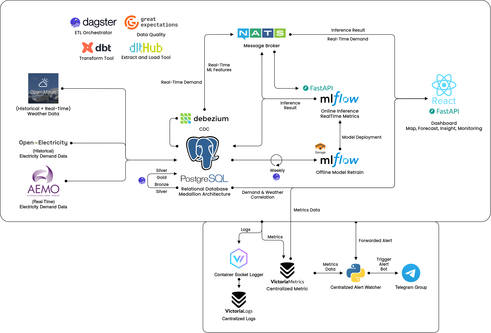

# VoltaicMap

Real-Time Electricity Demand Prediction Based on Weather Forecast with Machine Learning — across all 5 Australian NEM states.



---

## Project Structure

```
.
├── dagster/                # Orchestration (Dagster assets, jobs, schedules)
│   ├── definitions.py      # Asset graph, jobs, schedules
│   ├── jobs/
│   │   ├── assets/         # bronze.py, silver.py (dbt), gold.py, ml.py
│   │   ├── train_model.py  # XGBoost multi-output training
│   │   ├── historical_load.py
│   │   ├── validate_data.py
│   │   ├── gold_correlation.py
│   │   └── preprocessing.py
│   └── resources/          # Postgres I/O manager
├── dlt/                    # Data ingestion (DLT pipelines)
│   ├── pipelines/          # demand_aemo.py, weather_openmeteo.py
│   └── utils/              # openmeteo.py, openelectricity.py, triggers.py
├── dbt/                    # Transformations (dbt models)
│   └── models/silver/      # demand_5min, weather_hourly, features_ml
├── inference/              # Real-time ML inference service
│   ├── main.py             # NATS consumer + prediction loop
│   ├── predictor.py        # XGBoost model loading & inference
│   ├── features.py         # Feature engineering
│   └── models.py           # Data models
├── dashboard/
│   ├── backend/            # FastAPI backend (REST + WebSocket)
│   └── frontend/           # React + Vite + MapLibre dashboard
├── gx_quality/             # Great Expectations validation
├── monitor/                # Health monitoring service
├── configs/                # Dagster, Vector, Garage, Caddy configs
├── migrations/             # PostgreSQL init scripts (schemas + tables)
├── shared/                 # Shared utilities (logging, alerts, retry)
└── compose.dev.yaml        # Docker Compose (dev profile)
```

---

## Pipeline Flow (Medallion Architecture)

```
┌─────────────┐     ┌─────────────┐
│  OpenMeteo  │     │OpenElectricity│
│  (Weather)  │     │  (Demand)    │
└──────┬──────┘     └──────┬───────┘
       │                   │
       ▼                   ▼
  ┌─────────────────────────────────┐
  │         DLT (Ingestion)         │
  └──────────────┬──────────────────┘
                 │
                 ▼
  ┌─────────────────────────────────┐
  │  BRONZE (Raw)                   │
  │  bronze.demand                  │
  │  bronze.weather                 │
  └──────────────┬──────────────────┘
                 │  dbt transforms
                 ▼
  ┌─────────────────────────────────┐
  │  SILVER (Cleaned & Joined)      │
  │  silver.demand_5min             │
  │  silver.weather_hourly          │
  │  silver.features_ml             │
  │  silver.predictions             │
  └──────┬──────────────┬───────────┘
         │              │
         ▼              ▼
  ┌─────────────┐  ┌─────────────────┐
  │  GOLD (Agg) │  │  Inference      │
  │  correlation│  │  XGBoost × 5    │
  │  _hourly    │  │  (per region)   │
  │  _daily     │  │  24h forecasts  │
  └─────────────┘  └────────┬────────┘
                            │
                  ┌─────────▼─────────┐
                  │  Debezium CDC     │
                  │  Postgres → NATS  │
                  │  JetStream        │
                  └───────────────────┘
```

### Data Quality Checks

Each medallion layer is validated with **Great Expectations**:

- `bronze_validation` — raw demand + weather
- `silver_validation` — cleaned demand_5min + weather_hourly
- `features_validation` — ML feature set
- `predictions_validation` — inference output

---

## Data Sources

| Source | Data | Resolution | Usage |
|--------|------|------------|-------|
| [OpenMeteo](https://open-meteo.com/) | Weather (temperature, humidity, precipitation, cloud cover, wind speed, solar radiation) | Hourly API | Historical + RealTime Current + Forecast |
| [OpenElectricity](https://openelectricity.org.au) | Electricity demand | 5-minutely API | Historical |
| [AEMO NEMWEB](https://aemo.com.au) | Electricity demand | 5-minutely CSV | RealTime Current |

### Target Regions (NEM States)

| ID | Region |
|----|--------|
| NSW1 | New South Wales |
| QLD1 | Queensland |
| SA1 | South Australia |
| TAS1 | Tasmania |
| VIC1 | Victoria |

---

## Tech Stack

### Data Engineering

- **[Dagster](https://dagster.io/)** — Orchestration (assets, jobs, schedules, partitions)
- **[dlt](https://dlthub.com/)** — Data ingestion pipelines (OpenMeteo, OpenElectricity)
- **[dbt](https://www.getdbt.com/)** — SQL transformations (bronze → silver)
- **[Great Expectations](https://greatexpectations.io/)** — Data quality validation

### Machine Learning

- **[XGBoost](https://xgboost.readthedocs.io/)** — Multi-output regression (5 regions × 24 horizons)
- **[MLflow](https://mlflow.org/)** — Experiment tracking & model registry
- **[scikit-learn](https://scikit-learn.org/)** — Metrics (MAE, R²)

### Backend

- **[FastAPI](https://fastapi.tiangolo.com/)** — REST API + WebSocket
- **[DuckDB](https://duckdb.org/)** — In-process OLAP for analytics queries

### Frontend

- **[React 19](https://react.dev/)** — UI framework
- **[Vite](https://vitejs.dev/)** — Build tool
- **[MapLibre GL](https://maplibre.org/)** — Interactive map

### Infrastructure & Messaging

- **[PostgreSQL](https://www.postgresql.org/)** — Primary database (electricity, dagster_db, mlflow_db)
- **[NATS JetStream](https://nats.io/)** — Real-time CDC message streaming
- **[Debezium Server](https://debezium.io/)** — PostgreSQL CDC → NATS
- **[Garage](https://garagehq.deuxfleurs.fr/)** — S3-compatible object storage (MLflow artifacts, AEMO data)
- **[Caddy](https://caddyserver.com/)** — Reverse proxy

### Monitoring & Observability

- **[VictoriaMetrics](https://victoriametrics.com/)** — Time-series metrics
- **[VictoriaLogs](https://victoriametrics.com/)** — Log aggregation
- **[Vector](https://vector.dev/)** — Log collector (Podman/Docker → VictoriaLogs)
- **[Telegram Bot API](https://core.telegram.org/bots/api)** — Alerting

### DevOps

- **[Compose](https://docs.docker.com/compose/)** — Container orchestration

---

## Prerequisites

- [Podman](https://podman.io/) OR [Docker](https://docs.docker.com/engine/install/)
- [Podman-Compose](https://github.com/containers/podman-composehttps://github.com/containers/podman-compose) OR Docker Compose
- OpenElectricity API key — register at [openelectricity.org.au](https://openelectricity.org.au)
- (Optional) Telegram Bot API key + Chat ID for alerts

---

## Setup & How to Run

### 1. Clone & configure environment

```bash
cp .env.example .env
```

Edit `.env` and set:

```env
OPENELECTRICITY_API_KEY=<your-key>

# Optional: Telegram alerts
TELEGRAM_BOT_API_KEY=<your-bot-key>
TELEGRAM_CHAT_ID=<your-chat-id>
```

### 2. Start all services

```bash
docker compose -f compose.dev.yaml --profile dev up -d
```

### 3. Verify services are healthy

```bash
docker compose -f compose.dev.yaml --profile dev ps
```

Wait for all services to show `healthy` status.

### 4. Access services

| Service | URL |
|---------|-----|
| Dagster UI | <http://localhost:3000> |
| Dashboard Frontend | <http://localhost:5173> |
| Dashboard API | <http://localhost:8000> |
| MLflow UI | <http://localhost:5000> |
| NATS Monitoring | <http://localhost:8222> |
| NATS NUI (GUI) | <http://localhost:31311> |
| VictoriaMetrics | <http://localhost:8428> |

### 5. Run historical backfill (Dagster)

Open Dagster UI at <http://localhost:3000>, navigate to **Jobs → historical_backfill**, and launch a run to load historical demand & weather data.

### 6. Run model training

In Dagster UI: **Jobs → train_multi_output_xgboost** to train the XGBoost models (or wait for the weekly schedule).

### 7. Stop all services

```bash
docker compose -f compose.dev.yaml --profile dev down
```

---

## Service Ports

| Service | Port | Description |
|---------|------|-------------|
| PostgreSQL | `5432` | Primary database |
| Dagster Webserver | `3000` | Dagster UI |
| Dashboard Backend | `8000` | FastAPI REST + WebSocket |
| Dashboard Frontend | `5173` | React dev server |
| Dashboard Webserver (Caddy) | `8080` | Production reverse proxy |
| MLflow | `5000` | Experiment tracking UI |
| NATS | `4222` | Client connections |
| NATS HTTP Monitor | `8222` | NATS monitoring HTTP |
| NATS NUI | `31311` | NATS web GUI |
| VictoriaMetrics | `8428` | Metrics HTTP API |
| VictoriaLogs | `9428` | Logs HTTP API |
| Garage S3 | `3900` | S3-compatible API |
| Garage Admin | `3902` | Garage admin API |

---

## Dashboard API Endpoints

| Method | Path | Description |
|--------|------|-------------|
| `GET` | `/health` | Health check (DB + NATS status) |
| `GET` | `/demand/latest` | Latest demand for all 5 regions |
| `GET` | `/demand/history?region_id={id}&hours={n}` | Demand history for a region |
| `GET` | `/predictions/latest?region_id={id}` | Latest 24h prediction for a region |
| `GET` | `/predictions/accuracy?region_id={id}` | MAPE per horizon |
| `GET` | `/metrics/global` | Global metrics (max demand, latency, staleness) |
| `GET` | `/insight/data?region_id={id}&granularity={daily|hourly}` | Correlation data |
| `GET` | `/insight/correlation?region_id={id}` | Weather-demand correlation coefficients |
| `GET` | `/monitoring/accuracy?region_id={id}` | Prediction accuracy per region/horizon |
| `GET` | `/monitoring/uptime` | Service uptime (24h/7d) |
| `GET` | `/monitoring/latency` | Pipeline latency + trend |
| `GET` | `/monitoring/resources` | System CPU/Memory/Disk usage |
| `WS` | `/ws/live` | WebSocket for real-time demand updates |

---

## Scheduling

| Job | Schedule | Description |
|-----|----------|-------------|
| `gold_correlation_daily` | Daily at 01:00 (Sydney) | Build daily aggregated correlation |
| `train_multi_output_xgboost` | Weekly Monday 01:00 (Sydney) | Train XGBoost models with MLflow tracking |
